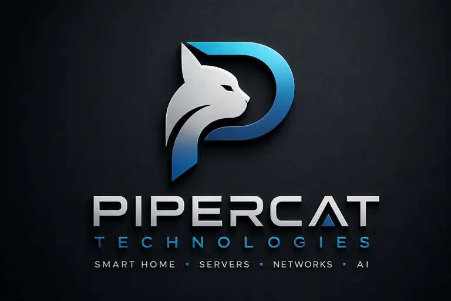

# Branding

  

## Offizielles Firmenlogo

Das oben dargestellte Logo ist das aktuell verbindliche Firmenlogo von **Pipercat Technologies** und soll an relevanten Stellen konsistent eingesetzt werden, insbesondere in Unternehmensdokumentation, Repository-Übersichten, Präsentationen, Angeboten, PDFs, Website-/Dashboard-Branding und weiteren offiziellen Außenauftritten.

## Offizielles Pipercat-Icon

`pipercat-icon.png` ist das kompakte Pipercat-Symbol **ohne Schriftzug**. Es wird für kleine Markenflächen, Icons und die Notion-Unterseiten verwendet. Dort steht es klein neben dem SystemONE-/S1-Logo oben rechts.

`pipercat-symbol.svg` bleibt nur noch als ältere technische Legacy-/Fallback-Variante bestehen.

## Markenbild

Pipercat Technologies soll seriös, technisch, modern und vertrauenswürdig auftreten.

## Gestaltungsprinzipien

- weißer Hintergrund für Geschäftsdokumente
- dunkles Blau als Hauptfarbe
- dezentes Cyan oder Türkis als Akzent
- klare Linien
- viel Weißraum
- vollständiges Firmenlogo auf Hauptseiten und Geschäftsdokumenten
- kleines Pipercat-Icon auf Unterseiten neben dem S1-Logo
- keine Beschriftungen direkt unter kleinen Icon-Logos
- keine Logos als zugeschnittenes Notion-Cover verwenden
- keine verspielten Effekte
- verständliche technische Sprache

## Claim

**Ein System. Beliebige Hardware. Erweiterbare Module. Zentrale Verwaltung.**

## Tonalität

- sachlich und lösungsorientiert
- technisch kompetent, aber verständlich
- transparent bei Grenzen und Risiken
- keine übertriebenen Leistungsversprechen
- Datenschutz und lokale Kontrolle als Vertrauensmerkmal

## Noch festzulegen

- exakte Farbwerte
- Typografie
- Mindestgröße und Schutzzone
- Icon-System
- Vorlagen für Angebote, Rechnungen und Präsentationen
