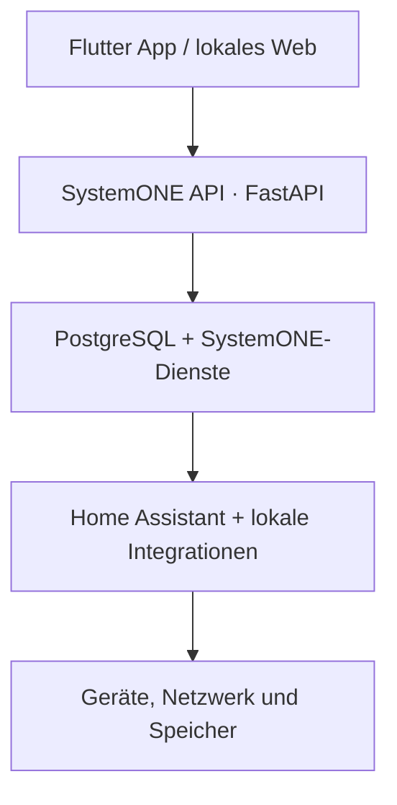

# Pipercat Technologies · Master-Dokumentation 2026

> **Ein System. Beliebige Hardware. Erweiterbare Module. Zentrale Verwaltung.**

**Dokumentstatus:** Master-Dokumentation · Stand 14. August 2026

Diese Dokumentation konsolidiert den aktuellen Planungsstand aus Notion und GitHub. Bei Widersprüchen gilt: **Notion = operative Produktentscheidungen und Roadmap; GitHub = Code, technische Dokumentation und Markenassets.**

---

## 1. Executive Summary

Pipercat Technologies ist ein Technologieunternehmen im Aufbau, das ein modulares, lokal betriebenes Ökosystem für Smart Home, Netzwerk, Daten, persönliche Organisation und künstliche Intelligenz entwickelt. Das Unternehmen verkauft nicht lediglich einzelne Raspberry Pis, Server oder Softwaremodule. Der Produktwert entsteht aus geprüfter Hardware, vorkonfigurierter Software, sicherem Onboarding, verständlicher Bedienung, lokaler Datenhaltung, dokumentierten Updates und optionaler Betreuung.

Im Zentrum steht **SystemONE** als gemeinsame Plattform und Produktfamilie. SystemONE wird in vier Hardwareklassen aufgebaut: **SystemONE Pi**, **SystemONE Mini**, **SystemONE Server** und **SystemONE Rack**. Alle Klassen teilen eine gemeinsame Plattformlogik, unterscheiden sich jedoch in Leistung, Speicher, KI-Fähigkeit und Ausbaustufe.

**YouDo** ist das integrierte Organisationsmodul für Kalender, Aufgaben und Projekte. **PEET** ist die lokale KI-Schicht für Sprache, Wissensverarbeitung, Tool-Nutzung und intelligente Assistenz. PEET ist nicht Bestandteil von SystemONE Pi oder Mini, sondern wird ausschließlich auf SystemONE Server und Rack lokal ausgeführt. Ergänzend verfolgt Pipercat Technologies **Digital Services** für Webseiten, Softwareentwicklung, Automatisierungen, KI-Integrationen, Netzwerk- und Serverkonzepte.

Die strategische Differenzierung lautet **Local-first**: Kernfunktionen sollen lokal beim Kunden laufen, ohne verpflichtende Pipercat-Cloud. Der Pipercat-Hauptserver ist nicht als zentrale Steuerungsinstanz vorgesehen, sondern ausschließlich für signierte Updates und später optional für Ende-zu-Ende-verschlüsselte Backups.

---

## 2. Unternehmensidentität

### 2.1 Name
**Pipercat Technologies**

### 2.2 Unternehmenszweck
Entwicklung, Integration und Bereitstellung modularer IT-, Smart-Home-, Server-, Netzwerk- und KI-Systeme sowie ergänzender digitaler Dienstleistungen.

### 2.3 Vision
Ein modulares, lokales Ökosystem für Smart Home, Netzwerk, Daten, Organisation und künstliche Intelligenz, das technische Komplexität hinter einer verständlichen und konsistenten Nutzeroberfläche verbirgt und von kleinen Systemen bis zu professionellen Rack-Installationen skalieren kann.

### 2.4 Mission
- Local-first als technischer Standard und Produktversprechen
- technische Komplexität durch geführte SystemONE-Abläufe reduzieren
- geprüfte Komplettgeräte statt unkontrollierter Hardwarevielfalt anbieten
- signierte und nachvollziehbare Updates bereitstellen
- lokale Kernfunktionen ohne Pflichtabonnement ermöglichen
- Datenschutz, Sicherheit und technische Grenzen transparent kommunizieren
- Produkte vom Einsteigergerät bis zur professionellen Infrastruktur skalierbar halten

### 2.5 Markenclaim
> **Ein System. Beliebige Hardware. Erweiterbare Module. Zentrale Verwaltung.**

### 2.6 Positionierung
Pipercat Technologies positioniert sich nicht als reiner Hardwarehändler. Hardware dient als kontrollierte und getestete Basis. Der Mehrwert entsteht aus Systemintegration, Vorkonfiguration, Software, Nutzerführung, Sicherheit, Dokumentation, Installation und optionalem Support.

---

## 3. Markenarchitektur

| Marke / Produkt | Rolle | Status |
|---|---|---|
| **Pipercat Technologies** | Unternehmensmarke und Absender | aktiv im Aufbau |
| **SystemONE** | Zentrale Plattform und Produktfamilie | Hauptprodukt |
| **YouDo** | Kalender-, Aufgaben- und Projektmodul | integriertes Modul |
| **PEET** | Lokale KI- und Assistenzebene | Server/Rack |
| **Digital Services** | Web, Software, Automatisierung und Integration | ergänzender Geschäftsbereich |
| **Digital Screen / DigitalDash** | Display- und Dashboard-Konzept; Design- und Interaktionsvorläufer | Konzept / technische Grundlage |

### 3.1 Gestaltung
**Unternehmenskommunikation:** hell, hochwertig, viel Weißraum, Dunkelblau, Cyan/Türkis und klare Linien.

**SystemONE-Produktoberfläche:** Midnight-Design mit Schwarz-/Dunkelblau-Verläufen, blauen und violetten Lichtakzenten, anthrazitfarbenen Karten, transparenten Rahmen, großen Rundungen, touchfreundlichen Elementen und Glassmorphism-Navigation.

**Sprache:** sachlich, technisch kompetent, verständlich und transparent.

### 3.2 Logo-Status
Das vorhandene SystemONE-Schildlogo ist die aktuell verbindliche Produkt-Assetquelle. Ein eigenständiges finales Pipercat-Technologies-Unternehmenslogo inklusive Vektorvarianten und Brand Guide ist noch zu erstellen. Das SystemONE-Logo darf daher nicht als endgültiges Unternehmenslogo ausgegeben werden.

---

## 4. Geschäftsmodell

### 4.1 Grundmodell
- Hardware und lokale Kernsoftware als Einmalkauf
- kostenlose Companion-App für iOS und Android
- lokale Kernfunktionen dauerhaft ohne Abonnement
- Sicherheitsupdates im Produkt enthalten
- Self Setup und kostenpflichtiges Home Setup zum Launch
- später optionale Abonnements für SystemONE Care und SystemONE Cloud Backup

### 4.2 Erlösquellen
1. Verkauf geprüfter SystemONE-Komplettgeräte
2. Vor-Ort-Installation und Einrichtung
3. Hardware- und System-Upgrades
4. optionale Wartungs- und Supportverträge
5. optionales verschlüsseltes Cloud Backup
6. individuelle Digital Services
7. spätere professionelle Server- und Rack-Projekte

### 4.3 Go-to-Market
1. eigener Haushalt als System 0
2. Familie als interne Pilotstufe
3. Freunde als vergünstigte Pilotkunden
4. ausgewählte externe Beta
5. öffentlicher Launch

Jede Pilotwelle soll erst erweitert werden, wenn kritische Fehler der vorherigen Stufe dokumentiert und behoben wurden.

---

## 5. SystemONE · Plattform

SystemONE ist die zentrale modulare Local-first-Plattform von Pipercat Technologies. Sie vereinheitlicht Smart Home, Netzwerkfunktionen, Datenhaltung, Organisation, Systemverwaltung und – auf leistungsfähigen Modellen – lokale KI.

Home Assistant wird intern als Smart-Home-Basis verwendet, bleibt für normale Kunden jedoch vollständig verborgen. Nutzer interagieren ausschließlich mit der SystemONE-App oder der lokalen Weboberfläche.

### Zentrale Prinzipien
- Local-first
- keine verpflichtende zentrale Pipercat-Control-Plane
- lokale Benutzer-, Rechte- und Gerätesteuerung
- kontrollierte Hardware- und Integrationskompatibilität
- signierte Updates
- A/B-Updateverfahren mit automatischem Rollback
- reproduzierbare Deployments
- Backup und Recovery als Kernfunktion
- transparente Diagnose und freiwillige Freigabe

---

## 6. SystemONE Produktfamilie

| Modell | Smart Home | Pi-hole | NAS | Kameraspeicher | Lokale KI / PEET |
|---|---:|---:|---:|---:|---:|
| **SystemONE Pi** | Ja | Ja | Nein | begrenzt | Nein |
| **SystemONE Mini** | Ja | Ja | Ja | Ja | Nein |
| **SystemONE Server** | Ja | Ja | Ja | Ja | Ja |
| **SystemONE Rack** | Ja | Ja | Ja | Ja | Ja, stark erweiterbar |

### 6.1 SystemONE Pi
Einstiegsprodukt und erster Entwicklungsfokus. Geplante Hardwarebasis: Raspberry Pi 5 mit 8 GB RAM, 256 GB NVMe-SSD, aktiver Kühlung und definiertem Zigbee-Adapter.

**Kernfunktionen**
- Smart-Home-Steuerung über eigene SystemONE-Oberfläche
- optional Pi-hole
- Geräteprofile für Licht, Steckdose/Schalter, Sensor, Heizung/Thermostat und Rollladen/Jalousie
- lokale Kamera-Liveansicht ohne Aufzeichnung
- einfache Automationsvorlagen
- YouDo Kalender und YouDo Aufgaben/Projekte als aktivierbare Module
- lokales Web sowie kostenlose iOS-/Android-App

**Nicht Bestandteil des ersten Pi-MVP**
- PEET
- Sprachsteuerung
- Kameraaufzeichnung oder Bildanalyse
- zentrale Pipercat-Control-Plane
- Import bestehender Home-Assistant-Installationen
- garantierter Fernzugriff bei CGNAT

### 6.2 SystemONE Mini
All-in-one-Stufe mit Smart Home, Pi-hole, NAS und Kameraspeicher ohne lokale KI. Vorgesehen sind eine separate System-SSD und mindestens zwei gespiegelte NAS-Datenträger.

### 6.3 SystemONE Server
Leistungsfähige lokale Plattform für Smart Home, Netzwerk, NAS, Kameraspeicher, Dokumentwissen und lokale KI. Ab dieser Stufe werden PEET, Sprachsteuerung und lokale KI-Verarbeitung freigeschaltet.

### 6.4 SystemONE Rack
Professionelle und stark erweiterbare Variante für größere Installationen. Vorgesehen sind flexible ZFS-Speicherprofile, erweiterbare Rechenleistung, lokale KI sowie modulare Rack-, Netzwerk- und Speicherinfrastruktur.

---

## 7. SystemONE Pi · MVP

### 7.1 Ziel
Der erste belastbare MVP beweist einen vollständigen, für Endkunden verständlichen Philips-Hue-Ablauf auf einem neuen SystemONE-Pi-System.

### 7.2 Vertikaler Hue-Prototyp
1. SystemONE Pi starten und lokal erreichen.
2. Administratorgerät über QR-Sticker koppeln.
3. Philips Hue Bridge automatisch erkennen.
4. Kopplung durch Bridge-Tastendruck bestätigen.
5. Lampen laden und normalisieren.
6. Lampe einem Raum zuweisen und benennen.
7. Lampe schalten und dimmen.
8. Zustände zwischen Home Assistant, API und Flutter live synchronisieren.
9. Lade-, Offline-, Fehler-, Erfolgs- und Wiederholen-Zustände verständlich darstellen.

### 7.3 Integrationsreihenfolge
1. Philips Hue
2. lokal steuerbare Govee-Modelle
3. Matter
4. Shelly
5. Zigbee über freigegebenen Zigbee-Stick
6. Wallboxen
7. weitere getestete Hersteller und Kategorien

### 7.4 Kompatibilitätsstufen
- **SystemONE Certified:** vollständig getestet
- **SystemONE Compatible:** Kernfunktionen getestet
- **Experimentell/Beta:** Integration ohne vollständige Funktionsgarantie
- **Nicht unterstützt:** nicht im normalen Einrichtungsablauf

---

## 8. Technische Zielarchitektur

### 8.1 Verbindlicher Stack
- Debian
- Docker Compose
- FastAPI
- PostgreSQL
- Flutter
- REST für Verwaltung und Befehle
- WebSockets für Live-Zustände
- Home Assistant als interne Smart-Home-Basis

### 8.2 Deploymentprinzip
Alle Hardwareklassen teilen dieselbe API-, Benutzer- und Berechtigungslogik. Modellabhängige Deployment-Profile aktivieren oder deaktivieren Funktionen anhand der Hardwareklasse.

### 8.3 Update-Architektur
- signierte Softwarepakete
- Online- und Offline-Updates
- A/B-Systemupdate
- automatischer Rollback bei fehlgeschlagenem Start oder Healthcheck
- Wiederherstellungsweg unabhängig von der normalen App
- Sicherheitsupdates als Bestandteil der lokalen Kernsoftware

---

## 9. Onboarding, Identität und Berechtigungen

Das Onboarding soll über einen temporären lokalen SystemONE-Hotspot bzw. lokalen Erstzugriff erfolgen. Ein QR-Sticker enthält Geräteidentität und einmaliges Geheimnis. Dadurch wird das erste Administratorgerät gekoppelt.

Geplante Rollen:
- Administrator / Eigentümer
- Mitglied
- Gast
- Wanddisplay-/Kioskprofil

Eigentumsübertragung und Recovery gehören zu den sicherheitskritischen Bereichen und benötigen eigene Threat Models, physische Recovery-Mechanismen und dokumentierte Übergabeprozesse.

---

## 10. SystemONE App

Flutter dient als gemeinsame UI-Technologie für lokale Weboberfläche, iOS/iPadOS und Android. Entwicklungsreihenfolge: **Web → iOS → Android**. Zum öffentlichen Launch sollen iOS und Android gleichwertig unterstützt werden.

### Navigation
**Fester Kern:** Home, Räume, Geräte, Mehr.

**Dynamische Module:** Energie, Laden, Pool, Klima, Sicherheit und Medien erscheinen nach aktivierter Hardware bzw. aktivierten Modulen.

### Adaptives Layout
- Smartphone: einspaltig, kurze Wege
- Tablet/Wanddisplay: mehrspaltiges Dashboard
- Desktop/Web: breites Raster
- Kiosk-Modus: reduzierte Bedienoberfläche

### Bearbeitungsmodus
- Dashboardkarten sortieren
- Module und Karten ein-/ausblenden
- Kartengröße grob wählen
- Schnellzugriffe festlegen
- Standardanordnung wiederherstellen
- persönliche Ansichten je Nutzerrolle

---

## 11. YouDo

YouDo ist das integrierte SystemONE-Modul für Kalender, Aufgaben und Projekte. Ziel ist eine lokale Organisationsschicht, die unabhängig aktiviert werden kann und später eng mit PEET zusammenarbeitet.

### Funktionsbereiche
- Kalender
- Aufgabenlisten
- Projekte
- persönliche Organisation
- SystemONE-Dashboardintegration
- spätere KI-gestützte Aufgabenanlage über PEET

YouDo ist kein separates Konkurrenzprodukt zu SystemONE, sondern ein modular aktivierbarer Bestandteil des Ökosystems. Die bestehenden GitHub-Projekte dienen als technische Vorarbeit und Entwicklungsbasis.

---

## 12. PEET · Lokale KI

PEET ist die intelligente Assistenzschicht von Pipercat Technologies. Sie verbindet Sprache, Large Language Models, lokales Wissen, SystemONE, YouDo und Smart-Home-Funktionen.

### Produktgrenze
PEET und Sprachsteuerung laufen ausschließlich auf **SystemONE Server** und **SystemONE Rack**. Pi und Mini enthalten keinen PEET-Chat und keine lokale Sprachassistenz.

### Ziel-Funktionen
- Sprache und Text verstehen
- lokale LLMs nutzen
- Dokumente und Wissensbestände durchsuchen
- Aufgaben in YouDo erzeugen
- SystemONE- und Smart-Home-Aktionen auslösen
- Informationen zusammenfassen
- Aktionen vor Ausführung prüfen
- Audit-Logs führen

### Sicherheitsprinzipien
- kritische Aktionen nur nach Nutzerbestätigung
- Least-Privilege-Zugriff
- Rollen- und Berechtigungsmodell
- Audit-Logging
- Schutz vor Prompt Injection und manipulierten Dokumenten
- lokale Verarbeitung als Standard

---

## 13. Daten, NAS, Kameras und Dokumente

Kundendaten sollen standardmäßig lokal gespeichert und verarbeitet werden. Der Pipercat-Hauptserver verarbeitet keine Smart-Home-, Kamera-, Kalender-, Dokument-, Sprach- oder PEET-Inhalte.

NAS-Funktionen beginnen mit SystemONE Mini. Server und Rack verwenden ZFS-basierte Speicherprofile. Spiegelung und RAID verbessern Verfügbarkeit, ersetzen aber kein Backup.

Im Pi-MVP ist ausschließlich lokale Kamera-Liveansicht vorgesehen. Aufzeichnung folgt auf leistungsfähigeren Systemen. Lokale KI-Bildverarbeitung gehört zu Server und Rack.

### SystemONE Cam Indoor
Geplantes Komplettprodukt mit WLAN, USB-C, lokalem Stream, QR-Kopplung, individuellem Zertifikat, signierter Firmware, ohne Standardpasswort und ohne verpflichtende Cloud.

---

## 14. Netzwerk und Fernzugriff

SystemONE soll auch ohne Pipercat-Konto und ohne zentrale Pipercat-Cloud lokal funktionieren.

Ein späterer Fernzugriff soll direkt über WireGuard erfolgen. Pipercat betreibt dabei kein Relay für Kundendaten. Einschränkungen wie CGNAT müssen transparent kommuniziert werden.

Pi-hole ist ein optionales Modul für SystemONE Pi und höher. Ein FRITZ!Box-orientiertes Einrichtungsprofil ist für den MVP-Ausbau vorgesehen.

---

## 15. Digital Services

Digital Services ergänzt die Produktentwicklung und kann frühe Umsätze ermöglichen.

### Leistungen
- Webseiten und Webanwendungen
- individuelle Softwareentwicklung
- Automatisierungen
- KI-Integrationen
- Netzwerk- und Serverkonzepte
- technische Beratung
- Systemintegration

### Zielgruppen
Privatkunden, Selbstständige, Handwerksbetriebe, kleine Unternehmen und lokale Organisationen.

### Historische Planungsrahmen
Die bestehende GitHub-Dokumentation nennt unverbindliche Planungswerte von etwa 500–5.000 EUR für Webseiten, 300–5.000 EUR für Automatisierungen, 500–10.000 EUR für KI-Integrationen und 1.000–50.000 EUR für individuelle Softwareprojekte. Diese Werte sind **keine freigegebene Preisliste** und müssen durch aktuelle Kosten-, Risiko- und Margenkalkulation ersetzt werden.

---

## 16. Sicherheit und Datenschutz

### Grundprinzipien
- lokale Datenhaltung
- minimale Cloud-Abhängigkeit
- signierte Pakete
- kontrollierte Berechtigungen
- keine Standardpasswörter
- Diagnose nur nach sichtbarer Zustimmung
- sensible Aktionen nachvollziehbar protokollieren
- Recovery und Eigentumsübergabe technisch absichern

### Sicherheitskritische Bereiche
Eigentumsübertragung, Recovery, signierte Updates, Kameras, Poolsteuerung, Türschlösser, Alarmanlage, Cloud Backup, lokale KI, Diagnoseexport und Fernzugriff benötigen vor Produktion jeweils eigene Threat Models und Tests.

---

## 17. Cloud Backup und Pipercat-Hauptserver

Der Pipercat-Hauptserver ist **keine zentrale Steuerungsplattform für Kundensysteme**. Seine vorgesehenen Rollen sind die Verteilung signierter Updates und später optional verschlüsselte Backups.

Ein späteres SystemONE Cloud Backup soll clientseitig Ende-zu-Ende verschlüsselt werden. Nur der Kunde besitzt den Schlüssel. Vertrags-, Lösch-, Aufbewahrungs-, Insolvenz- und Ausfallszenarien müssen vor Einführung rechtlich und technisch geklärt werden.

---

## 18. Recht, Compliance und Unternehmensgründung

> Dieser Abschnitt ist interne Arbeitsdokumentation und keine Rechts- oder Steuerberatung. Vor Verkauf, Veröffentlichung oder Vertragsverwendung ist fachkundige Prüfung erforderlich.

### Noch offene Unternehmensentscheidungen
- Inhaber und endgültige Firmendaten formell dokumentieren
- Rechtsform
- Geschäftsanschrift
- Startdatum
- Zielregion für Vor-Ort-Leistungen
- Domain und geschäftliche E-Mail-Adressen
- Support- und Reaktionszeiten
- Fahrtkosten
- Lieferanten
- Gewährleistungs-, Reparatur- und Austauschprozess
- finale Kosten-, Margen- und Preisrechnung

### Vor Launch zu prüfen
- AGB
- Leistungsbeschreibung und Verbraucherinformationen
- Widerruf und Versand
- Eigentum, Gewährleistung und Reparatur
- Vor-Ort-Installation und Abnahme
- Haftungsgrenzen
- Open-Source-Lizenzen
- Datenschutzinformationen
- Videoüberwachung
- KI-Transparenz
- Cloud-Backup-Vertrag
- App-Store- und Play-Store-Anforderungen
- Elektro-, Funk-, Verpackungs-, Batterie- und Produktsicherheitsanforderungen
- steuerliche Behandlung von Pilotgeräten

### Erforderliche Dokumente
- Impressum
- Datenschutzerklärung
- AGB
- Produkt- und Leistungsbeschreibung
- Angebot und Auftragsbestätigung
- Übergabe und Abnahme
- Installations- und Sicherheitshinweise
- Update-, Backup-, Recovery- und Supportbedingungen
- Pilot-/Beta-Vereinbarung
- Einwilligungs- und Berechtigungsdokumente
- Open-Source- und KI-Hinweise

---

## 19. Roadmap

### Phase 0 · Produkt- und Entwicklungsgrundlage
- Repository- und Verzeichnisstruktur
- Debian-Basis und Docker Compose
- FastAPI, PostgreSQL, Home Assistant und Flutter Web reproduzierbar starten
- Konfiguration, Secrets, Logging und Tests
- Geräteidentität und lokale Entwicklungslizenz

### Phase 1 · Sicheres lokales Onboarding
- temporärer SystemONE-Hotspot
- QR-Sticker-Schema
- Administrator-/Eigentümerkonto
- App-Geräteidentität
- Recovery mit physischem Zugriff
- Ethernet/WLAN/Wiederverbindung

### Phase 2 · Vertikaler Hue-Prototyp
- Hue Bridge erkennen
- Bridge-Tastendruck führen
- Lampen laden
- Raum- und Namenszuweisung
- Schalten und Dimmen
- WebSocket-Synchronisierung
- Fehler- und Offlinezustände

### Phase 3 · Midnight UX
- responsive Komponenten
- Design-Tokens
- Home/Räume/Geräte/Lichtdetail/Gerät hinzufügen
- dynamische Module
- Bearbeitungsmodus

### Phase 4 · MVP-Ausbau
- weitere Geräteprofile
- Govee, Matter, Shelly, Zigbee und Wallboxen
- Automationsvorlagen
- lokale Kamera-Liveansicht
- Pi-hole
- YouDo

### Phase 5 · Betriebssicherheit
- signierte Updates
- A/B-Rollback
- Backup und Restore
- Diagnoseexport mit Redaction
- SSH-Expertenmodus

### Phase 6 · Pilot und Launch
Eigener Haushalt → Familie → Freunde → externe Beta → öffentlicher Launch.

---

## 20. Freigabekriterien für den Pilot

- kein Home-Assistant-Fachwissen erforderlich
- unterstützte Hue-Lampe vollständig über SystemONE einrichtbar
- lokaler Betrieb ohne Pipercat-Konto
- keine kritischen Kundendaten auf dem Pipercat-Hauptserver
- Update- und Wiederherstellungsweg getestet
- Smartphone-, Tablet- und Weblayout stabil
- Pilotfehler und Supportbedarf dokumentiert
- sicherheitskritische Funktionen vor Freigabe bewertet

---

## 21. Repository- und Dokumentationsstrategie

### Pipercat-Technologies
Zentrale Unternehmens-, Produkt-, Rechts-, Preis-, Branding- und Architektur-Dokumentation.

### SystemONE
Technische Implementierung, SystemONE-Code, Generatoren, UI/Assets und produktnahe technische Dokumentation.

### YouDo / YouDo_6
Bestehende technische Entwicklungsstände und Prototypen des YouDo-Moduls.

### Quellenprinzip
- **Notion:** operative Produktentscheidungen, Roadmap, Aufgaben und Entscheidungslog
- **GitHub:** versionierte technische Dokumentation, Code und Assets
- **Master-Dokumentation:** konsolidierte Management-, Produkt- und Technikübersicht

---

## 22. Aktueller Status · 14. August 2026

Das Unternehmen befindet sich weiterhin in der Aufbau- und Vorproduktionsphase. Die grundlegende Produktstrategie, Local-first-Architektur, SystemONE-Produktfamilie, der Stack und die MVP-Abgrenzung sind inzwischen deutlich konkreter als in der ursprünglichen GitHub-Version 0.1.

Der aktuelle Entwicklungsfokus liegt auf **SystemONE Pi** und einem vollständigen vertikalen Philips-Hue-Prototyp. Der nächste technische Beweis besteht aus reproduzierbarer Debian-/Docker-Umgebung, sicherem QR-/Hotspot-Onboarding, lokaler Hue-Kopplung, Live-Synchronisierung über API/WebSockets sowie einer adaptiven Midnight-Oberfläche.

---

## 23. Prioritäten

1. SystemONE-Pi-Entwicklungsumgebung reproduzierbar aufsetzen.
2. Hue-End-to-End-Prototyp stabil fertigstellen.
3. QR-/Geräteidentität und Recovery technisch beweisen.
4. A/B-Update- und Rollbackpfad testen.
5. App-Midnight-UI für Web stabilisieren.
6. Pilot-Prozess und Fehlerdiagnose standardisieren.
7. eigenständiges Pipercat-Unternehmenslogo und Brand Guide erstellen.
8. Firmendaten, Rechtsform, Preise und Supportmodell finalisieren.
9. rechtliche Dokumente fachkundig prüfen lassen.
10. anschließend Familienpilot und externe Beta kontrolliert ausrollen.

---

## 24. Verwandte Repositories

- `Pipercat/Pipercat-Technologies`
- `Pipercat/SystemONE`
- `Pipercat/SystemONE_001`
- `Pipercat/YouDo`
- `Pipercat/YouDo_6`

---

## 25. Leitgedanke

> **Pipercat Technologies soll kein loses Bündel technischer Einzelprojekte sein, sondern ein konsistentes, sicher betreibbares und verständlich bedienbares Local-first-Ökosystem mit SystemONE als gemeinsamer Plattform.**
