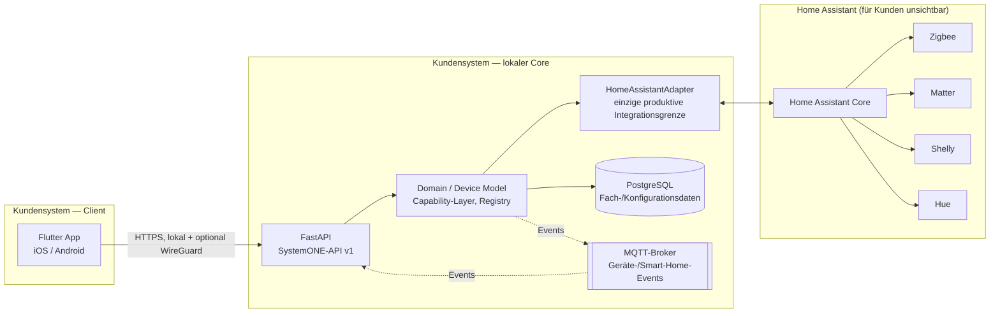
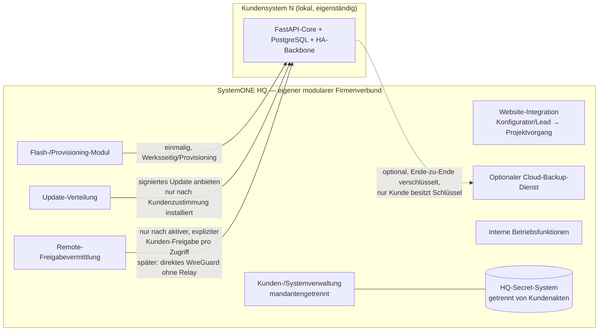

# ADR-0002: SystemONE-Zielarchitektur — Flutter/FastAPI/PostgreSQL/MQTT mit Home-Assistant-Backbone

- Status: angenommen
- Datum: 17. August 2026
- Geltungsbereich: SystemONE-Kundensysteme (Pi/Mini/Server/Rack) und SystemONE HQ, ab dem `2026-08 Neuaufbau`-Entwicklungsplan (`S1V2-*`)
- Erledigt Notion-Aufgabe `S1V2-01-001 · Zielarchitektur für SystemONE und SystemONE HQ final dokumentieren`
- Ersetzt teilweise: [ADR-0001](adr-0001-systemone-pi-pilot.md)

## Kontext

[ADR-0001](adr-0001-systemone-pi-pilot.md) (13.08.2026) legte für den geschlossenen SystemONE-Pi-Pilot einen eigenständigen Node.js-Monolithen ohne Home Assistant, ohne Datenbank und ohne Flutter-Client fest, mit einer expliziten Neubewertung erst „nach dem eigenen Haushaltspilot und vor einer externen Beta“.

Am 17.08.2026 wurde diese Neubewertung vorgezogen und abgeschlossen:

- **DEC-4** („Finaler Technologie-Stack für SystemONE festgelegt“) legt verbindlich fest: Flutter (Client), FastAPI (Backend/API), PostgreSQL, Debian, Docker Compose, MQTT für Geräte-/Smart-Home-Events. Redis/Celery/NATS nur bei nachgewiesenem Bedarf.
- Die (bislang nur als Notion-Aufgabentext dokumentierte, siehe `S1-03-001`) Architekturentscheidung stellt zusätzlich fest: Der Konflikt zwischen ADR-0001 (direkter Hue-Adapter, kein Home Assistant) und einer vorgegebenen v1.0-Zielarchitektur (Home Assistant als verbindliche, für Endkunden unsichtbare Integrationsschicht) wird zugunsten von Home Assistant als **Pflichtschicht** aufgelöst.
- Ein vollständiger 105-Punkte-Entwicklungsplan (`S1V2-*`, Notion-Ansicht „Aktueller Entwicklungsplan“) baut durchgängig auf diesem Stack auf (u. a. `S1V2-02-016` ff. für den `HomeAssistantAdapter`, `S1V2-02-001` für das PostgreSQL-Datenmodell, `S1V2-02-004` für den MQTT-Eventbus).

Der bestehende Repository-Code (`mvp/systemone-pi/`, siehe [`../current-state.md`](../current-state.md)) entspricht vollständig ADR-0001 und keinem Teil dieser neuen Zielarchitektur. Das ist erwartet, kein Fehler — die Migration beginnt mit `S1V2-01-002`.

## Entscheidung

### Kundensystem (Pi/Mini/Server/Rack)

- **Client:** Flutter, ausschließlich über den stabilisierten SystemONE-API-/Event-Vertrag (`S1V2-01-004`). Keine direkte Home-Assistant-UI, kein direkter Geräte-/Herstellerzugriff.
- **Backend/API:** FastAPI, lokal auf dem Kundensystem betrieben. Domain Layer (Haushalt, Räume, Geräte, Capabilities) + Service-/Repository-Schicht mit Transaktionen und Berechtigungs-Hooks.
- **Persistenz:** PostgreSQL für Fach-/Konfigurationsdaten (Nutzer, Rollen, Räume, Automationen, Auditverlauf). MQTT ausschließlich für Geräte-/Smart-Home-Echtzeitereignisse, nicht als Konfigurationsspeicher.
- **Geräteintegration:** `HomeAssistantAdapter` ist die **einzige produktive** Smart-Home-Integrationsgrenze (`S1V2-02-016`). Home Assistant selbst bleibt für den Endkunden vollständig verborgen — kein sichtbarer HA-Login, keine HA-Weboberfläche im Kundenpfad. Zigbee/Matter/Shelly/Hue laufen alle über Home Assistant, nicht über eigene Direktadapter.
- **Deployment:** Debian + Docker Compose als gemeinsame Basis für alle Modelle. Pi/Mini bleiben bewusst schlank (minimale Containeranzahl); Server/Rack dürfen zusätzliche Isolation (weitere Container/VMs) nutzen, ohne den gemeinsamen SystemONE-Stack zu verändern.

### SystemONE HQ

- SystemONE HQ ist ein **eigener modularer Firmenverbund** (DEC-199), technisch getrennt von jedem Kundensystem, mit intern getrennten Modulen: Flash-/Provisioning (`S1V2-03-005`), Kunden-/Projektverwaltung (`S1V2-03-003`, strikt mandantengetrennt: `Customer`, `Project`, `SystemONE Device/System`, `Configuration`, `Offer reference`, `SupportCase`, `ServicePlan`, `Installation/Acceptance` — Datenzugriffe immer mandanten-/projektgebunden), Website-Integration, Update-Verteilung, Remote-Freigabevermittlung, optionaler Cloud-Backup-Dienst und interne Betriebsfunktionen.
- **Keine Laufzeitabhängigkeit:** Kein Kundensystem benötigt eine laufende Verbindung zu HQ für seine Kernfunktionen (Gerätesteuerung, Automationen, lokales Backup, lokale Nutzerverwaltung). HQ „verwaltet“, ist aber keine Betriebsvoraussetzung.
- **Secrets getrennt:** HQ führt ein eigenes Secret-System, das nicht in Kundenakten oder Kundensystem-Paketen landet (Grenze auch auf Code-/Paketebene, siehe `S1V2-01-002`: „HQ-Secrets/Kundendaten/Adminlogik nicht in Kundensystem-Pakete ziehen“).

## Trust Boundaries und Datenflüsse

| Grenze | Regel |
|---|---|
| Flutter-App ↔ FastAPI (Kundensystem) | Nur über SystemONE-API v1 (`success/data/error`-Vertrag), TLS-Pflicht, Session-/Rollen-/CSRF-Schutz analog zum bestehenden Node.js-Vorbild (`current-state.md`, Abschnitt 3), fail-closed bei ungültigem TLS-Material. |
| FastAPI ↔ HomeAssistantAdapter ↔ Home Assistant | Herstellercredentials und HA-interne Daten verlassen den öffentlichen SystemONE-Vertrag nicht; nur normalisierte Capabilities/Events kreuzen die Grenze. |
| Kundensystem ↔ SystemONE HQ (Setup/Provisioning) | Einmalig bei Werksprovisionierung; danach keine Pflichtverbindung. |
| Kundensystem ↔ SystemONE HQ (Updates) | Nur Update-**Angebot**; Installation ausschließlich nach ausdrücklicher Kundenzustimmung, signiert, mit vorherigem Backup und getestetem A/B-Rollback. |
| Kundensystem ↔ SystemONE HQ (Remote) | Standardmäßig deaktiviert (DEC-38). Jeder Zugriff erfordert aktive, ausdrückliche Freigabe des Kunden für genau diesen Zugriff (Bestätigungs-Button/Einmalcode). Kein dauerhafter unbeaufsichtigter Fernzugriff. Übergangsweise über HQ vermittelt, später direkter WireGuard-Weg ohne Pipercat-Relay mit kurzlebigen/pro-Zugriff abgeleiteten Schlüsseln. |
| Kundensystem ↔ SystemONE HQ (Cloud Backup) | Rein optional. Kundendaten bleiben grundsätzlich auf dem Kundensystem; eine zusätzliche Sicherung zum HQ-Backupdienst ist bereits auf dem Kundengerät Ende-zu-Ende verschlüsselt, nur der Kunde besitzt den Schlüssel. |
| HQ-intern | Kunden-/Projektdaten strikt mandantengetrennt; jeder Datenzugriff mandanten-/projektgebunden; automatisierte Isolationstests müssen verhindern, dass ein Mitarbeiter über manipulierte IDs auf Kunde B zugreifen kann (`S1V2-03-003`). |
| Website-Konfigurator ↔ HQ | Konfigurator/Kontaktformular sind Lead-Erfassung, kein Checkout; jede Anfrage wird zu einem Projektvorgang in HQ (Lead → Angebotsworkflow). |

## Architekturgrenzen (übernommen/präzisiert aus ADR-0001)

1. Flutter-Client und jeder künftige Client greifen ausschließlich auf die öffentliche SystemONE-API und normalisierte Ereignisse zu.
2. Der `HomeAssistantAdapter` kapselt Discovery, Pairing, Gerätelisten, Aktionen und herstellerspezifische Credentials — analog zum bisherigen Adapter-Prinzip, jetzt aber mit Home Assistant als verpflichtender Zwischenschicht statt optionaler Direktadapter.
3. Capability-Layer und Registry validieren und normalisieren weiterhin alle Geräteänderungen.
4. Automationen verwenden denselben Capability-/Adapterpfad wie manuelle Befehle.
5. Persistenz (PostgreSQL), Backup und Diagnose erhalten keine nicht freigegebenen Secrets oder internen HA-/Adapterdaten.
6. Externe Module (Kamera, Pi-hole, YouDo) bleiben deaktivierbar und vom lokalen Core getrennt entwickelt.
7. Pi/Mini bleiben schlank; Server/Rack dürfen zusätzliche Isolation/Container/VMs nutzen, ohne den gemeinsamen SystemONE-Stack (API-Vertrag, Domain Model, HA-Backbone) zu verändern.

## Verhältnis zu ADR-0001

ADR-0001 wird **teilweise ersetzt**, nicht verworfen:

- **Ersetzt:** Rolle von Home Assistant (jetzt Pflichtschicht statt optional/verborgen-optional), Rolle von FastAPI/PostgreSQL/Flutter (jetzt verbindlicher Zielstack statt „mögliche spätere Bausteine“), Persistenzentscheidung (PostgreSQL statt ausschließlich dateibasiert für den neuen Stack).
- **Weiterhin gültig als Prinzip, jetzt auf den neuen Stack übertragen:** Local-first, keine Pflichtabhängigkeit vom HQ für Kernfunktionen, Adapterprinzip/Herstellerabstraktion, Update-Zustimmungspflicht, Backup-vor-Update, versionierte/validierte Backups, sicherheitsredigierte Diagnose.
- Der bestehende Node.js-Code aus dem ADR-0001-Piloten wird **nicht gelöscht**. Er dient als getestete fachliche/sicherheitstechnische Referenz für die neue FastAPI-Implementierung (siehe Migrationstabelle in [`../current-state.md`](../current-state.md), Abschnitt 8) und bleibt bis zu einem expliziten Abschaltbeschluss im Repository erhalten.

## Konsequenzen

Positiv:
- Ein einziger, unternehmensweit verbindlicher Zielstack für Pi/Mini/Server/Rack und HQ.
- Home Assistant übernimmt Discovery/Protokollarbeit für Zigbee/Matter/Shelly/Hue, statt dass SystemONE jeden Hersteller einzeln direkt integrieren muss.
- Klare Trust-Boundary-Tabelle als Grundlage für die Sicherheits-Negativtests aus `S1V2-02-015`.

Risiken:
- Vollständiger Technologiewechsel gegenüber dem bereits getesteten Node.js-Piloten — Migrationsaufwand, siehe `current-state.md`.
- Zusätzliche Betriebsabhängigkeit von Home Assistant als Drittsoftware innerhalb des Kundensystems (bleibt aber lokal, keine Cloud-Abhängigkeit von Home Assistant selbst).
- HA-Vertikalpfade (Hue über HA, Zigbee, Matter, Shelly) sind noch nicht real hardwaregetestet (`S1V2-02-022` ff.).

## Erneute Bewertung

Wird geprüft, falls der HA-Vertikalpfad (`S1V2-02-025`, Hue über Home Assistant) auf realer Hardware nicht innerhalb angemessenen Aufwands nachweisbar ist. In diesem Fall greift ADR-0001s Fallback-Gedanke: der bereits getestete direkte Hue-Adapter kann als befristeter Fallback dienen, bis der HA-Pfad hardwareseitig steht — das ist keine Rücknahme dieser Entscheidung, sondern eine Übergangsmaßnahme, die gesondert zu dokumentieren wäre.
