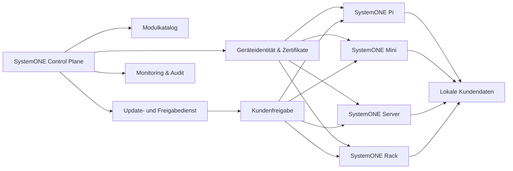
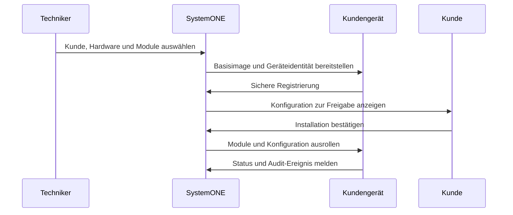
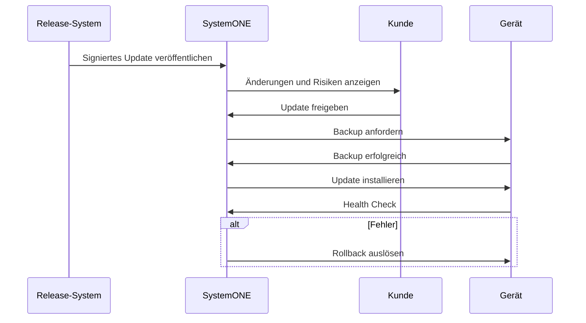

# Zielarchitektur

> Für den aktuellen SystemONE-Pi-Pilot gilt verbindlich [ADR-0001](adr-0001-systemone-pi-pilot.md). Die folgende Control-Plane-Architektur beschreibt eine spätere Produktstufe und ist keine Abhängigkeit des lokalen Pi-MVP.

## Überblick

## Architekturprinzipien

- Kundendaten bleiben standardmäßig lokal.
- Die zentrale Ebene speichert nur notwendige Verwaltungsmetadaten.
- Jedes Gerät besitzt eine eindeutige Identität.
- Kommunikation erfolgt verschlüsselt und authentisiert.
- Module werden versioniert und reproduzierbar bereitgestellt.
- Updates benötigen Kundenfreigabe und erzeugen vorher ein Backup.
- Kritische Aktionen sind protokolliert und rückrollbar.

## Provisionierungsprozess

## Updateprozess

## Noch zu entscheiden

- konkrete Container- und VM-Plattform
- Queue- und Event-Technik
- zentrale versus dezentrale Agentenlogik
- Zertifikatsstelle und Schlüsselrotation
- Offline-Updatepfad
- Mandanten- und Rollenmodell

## Verbindlicher Pi-Pilot

- modularer Node.js-Monolith mit eigener lokaler Weboberfläche
- normalisiertes Gerätemodell und austauschbare Herstelleradapter
- dateibasierte, atomare lokale Persistenz für den geschlossenen Pilot
- keine zentrale Control Plane und kein sichtbares Home Assistant im MVP
- FastAPI/PostgreSQL nur als spätere Neubewertung; Flutter nur als möglicher Client nach Stabilisierung des API-/Event-Vertrags
