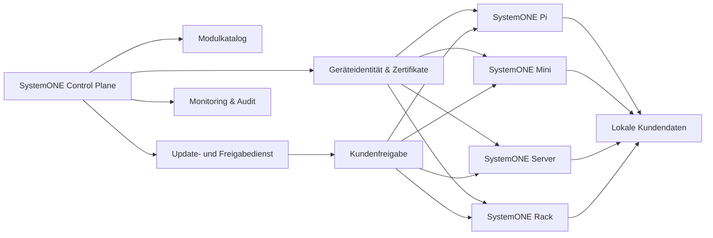
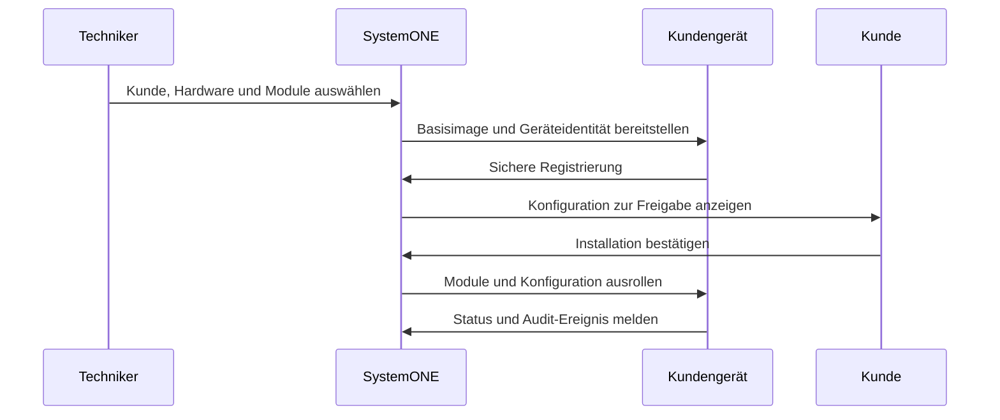
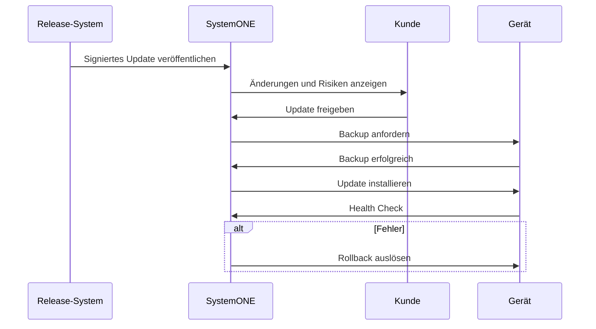

# Zielarchitektur

> **Stand 17.08.2026:** Die verbindliche Zielarchitektur für SystemONE-Kundensysteme und SystemONE HQ ist [ADR-0002](adr-0002-home-assistant-backbone.md) (Flutter/FastAPI/PostgreSQL/Docker Compose/MQTT mit Home Assistant als Pflicht-Backbone). Details, Komponenten- und Trust-Boundary-Diagramme siehe dort sowie [`../product-manifest.md`](../product-manifest.md). Der historische Pi-Pilot nach [ADR-0001](adr-0001-systemone-pi-pilot.md) bleibt als bestehender, funktionierender Node.js-Code erhalten (siehe [`../current-state.md`](../current-state.md)), ist aber **nicht** mehr der Zielstack. Die folgende Control-Plane-Skizze bezieht sich auf SystemONE HQ und deckt sich inhaltlich mit ADR-0002.

## Überblick

## Architekturprinzipien

- Kundendaten bleiben standardmäßig lokal.
- Die zentrale Ebene speichert nur notwendige Verwaltungsmetadaten.
- Jedes Gerät besitzt eine eindeutige Identität.
- Kommunikation erfolgt verschlüsselt und authentisiert.
- Module werden versioniert und reproduzierbar bereitgestellt.
- Updates benötigen Kundenfreigabe und erzeugen vorher ein Backup.
- Kritische Aktionen sind protokolliert und rückrollbar.

## Provisionierungsprozess

## Updateprozess

## Noch zu entscheiden

- konkrete Container- und VM-Plattform für Server/Rack (über die Docker-Compose-Basis hinaus)
- Zertifikatsstelle und Schlüsselrotation für HQ↔Kundensystem
- Offline-Updatepfad
- Mandanten- und Rollenmodell innerhalb HQ (Feinmodellierung, siehe `S1V2-03-003`)

Queue-/Event-Technik ist mit MQTT (Geräte-/Smart-Home-Events) entschieden (`DEC-4`); Redis/Celery/NATS nur bei nachgewiesenem Bedarf.

## Verbindliche Zielarchitektur (ADR-0002, 17.08.2026)

- Flutter-Client → FastAPI → Domain/Device Model → `HomeAssistantAdapter` → Home Assistant (für Kunden vollständig unsichtbar) → Zigbee/Matter/Shelly/Hue.
- PostgreSQL für Fach-/Konfigurationsdaten, MQTT für Geräte-/Smart-Home-Events.
- Debian + Docker Compose als gemeinsame Basis für Pi/Mini/Server/Rack; Pi/Mini bleiben schlank, Server/Rack dürfen zusätzliche Isolation nutzen.
- SystemONE HQ ist ein eigener, mandantengetrennter Firmenverbund ohne Laufzeitabhängigkeit des Kundensystems.
- Details, Komponenten- und Datenflussdiagramme sowie Trust-Boundary-Tabelle: siehe [ADR-0002](adr-0002-home-assistant-backbone.md).

## Historischer Pi-Pilot (ADR-0001, 13.08.2026 — Stack-Teile ersetzt)

- modularer Node.js-Monolith mit eigener lokaler Weboberfläche, weiterhin lauffähig unter `mvp/systemone-pi/`
- normalisiertes Gerätemodell und austauschbare Herstelleradapter (direkter Hue-/Govee-/Simulation-Adapter statt Home-Assistant-Backbone)
- dateibasierte, atomare lokale Persistenz statt PostgreSQL
- kein Flutter-Client, keine zentrale Control Plane, kein sichtbares Home Assistant
- dient als getestete fachliche/sicherheitstechnische Referenz für die ADR-0002-Implementierung, siehe [`../current-state.md`](../current-state.md), Abschnitt 8
